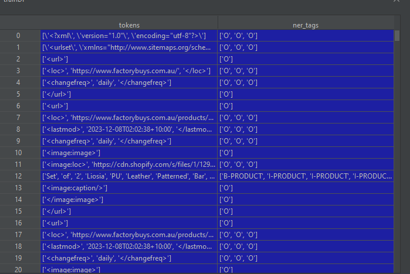
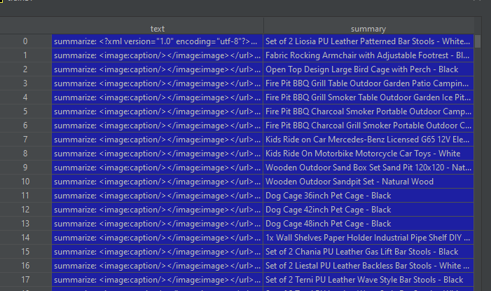

# NER with dataset created from scraping the web

The purpose is to do Name Entity Recognition where there is only one entity:Product 

Here I did fine-tuning using the standard distilbert model and also trying with xlm-roberta-base

These pretrained models are taken from the Huggingface 

Also since there is only 1 entity I tried to convert the problem from a NER problem to a Summarization problem 

### Dataset Aquisition
Our list of sites from where we get the products are Web shops.Web shops do a lot of SEO to be seen 
by search engines and actually facilitate search engines scraping them.For this they have robots.txt file
which is there to tell the scrapping program where it can find useful information the site wants to 
be broadcasted to the world

I use root site path  + /robots.txt and see what links are there , the most important link is the sitepath

I get the sitepath link from /robots.txt then navigate all link from it 

the content from those links will be xml documents where we see that  title tag   corresponds to products 

There is a link above the title tag upper in the XML tree , the  loc tag where if we access it we see 
the individual product page , this would be more useful if we want to get other data like price.
We would in that case navigate to that link and scrape from there 

I  downloaded the XML of each page and the list of product extracted from <loc> tag


### Dataset preprocessing 

So far the entry data  is a large XML and the output data  is a list of product names  

The XML is split into lines and for each line into words.
For each of the lines we know if it's the line where we have products from the product names list.
We then associate for each word in the line a NER tag.


The final dataset is in the form of a CVS file which has the structure:
List of words of words of line | List of NER tags associated for those words of line



The training data for both implementations is the CVS file data100SitesNEW_trunc.csv
which has 800000 + pairs of words and ner tags per word each corresponding to 1 sentence(
in our case corresponding to 1 line in the site XML file 
)
### Implementation notes:

I did the same implementation as presented in this link:

https://medium.com/@andrewmarmon/fine-tuned-named-entity-recognition-with-hugging-face-bert-d51d4cb3d7b5

I tried fine tunning 2 pre-trained models
- "distilbert-base-uncased"
- "xlm-roberta-base" 

It is important to note that the seqeval library from HuggingFace does not work if the data is not
in the standard NER structure 
that is why I used the standards suffixes for the labels 
- B-PRODUCT    where B prefix as Beginning word of product 
- I-PRODUCT    where I prefix as Mid word of product 
- E-PRODUCT    where E prefix as End word of product 


### Results Bert:

| Epoch | Training_Loss | Validation_Loss | Precision | Recall    | F1_score  |Accuracy|
|-------|---------------|-----------------|-----------|-----------|-----------|-----------|
| 1     | 	0.011200     | 	0.006536      | 	0.934946 | 	0.943322| 	0.939116|	0.998801 |
| 2     | 	0.009000  | 	0.006715     | 	0.942702| 	0.942487 |	0.942595|	0.998699 |


### Results Roberta:

| Epoch | Training_Loss | Validation_Loss | Precision | Recall    | F1_score  |Accuracy|
|-------|---------------|-----------------|-----------|-----------|-----------|-----------|
| 1     | 0.018900      | 	0.012661      | 	0.992290 | 	0.981397| 	0.986813 |	0.999439|
| 2     | 	0.012600   | 	0.004301       | 	0.987655 | 	0.993092 | 	0.990366|	0.999418|


to get such good results we have to preprocess the input as we did for extracting it
meaning passing it line by line in the model , a large chuck of site text will not produce the same results

results can be seen in trainingResults folder where each model is given a never before seen site,
downloads the site data and processes it outputing the NER tags in a CVS


### Extra Approach ---  Summarizaion  

Since we have only 1 entity we can also consider this problem as a Summarizaion problem.
We are given the site xml file and we have to extract from it the products 

in this approach I modified the dataset preprocessing step and created a new Dataframe



here a chunk of text input is created in a for loop each time the target is found in the text

example text:  
"<?xml version=""1.0"" encoding=""utf-8""?><urlset xmlns=""http://www.sitemaps.org/schemas/sitemap/0.9"" xmlns:image=""http://www.google.com/schemas/sitemap-image/1.1""><url><loc>https://www.factorybuys.com.au/</loc><changefreq>daily</changefreq></url><url><loc>https://www.factorybuys.com.au/products/2-x-premium-white-leather-bar-stools</loc><lastmod>2023-12-08T02:02:38+10:00</lastmod><changefreq>daily</changefreq><image:image><image:loc>https://cdn.shopify.com/s/files/1/1293/8737/products/BA-TW-NEW4045-WHX2-07.jpg?v=1670981706</image:loc><image:title>Set of 2 Liosia PU Leather Patterned Bar Stools - White &amp; Chrome</image:title>"  
target  
:Set of 2 Liosia PU Leather Patterned Bar Stools - White & Chrome


The benefit of this approach is that it can take in a full chunck of text and do well as long as we dont exceed the max input len of the model

Here I used T5 with Pytorch Lighting and got a good Rouge-L score

We add the prefix "summarize:"  to the input text as this is how the model was originally trained 

As evaluation, I took 1000 pairs of text and targets and got a rougeL score of 0.8929364

If we look at the summary the model creates its pretty good
Examples from training set : 

```diff
#input_text
summarize: <image:caption/></image:image></url><url><loc>https://www.factorybuys.com.au/products/30-inch-portable-fire-pit-free-shipping</loc><lastmod>2023-12-08T02:02:38+10:00</lastmod><changefreq>daily</changefreq><image:image><image:loc>https://cdn.shopify.com/s/files/1/1293/8737/products/FPIT-UFO-7676-99.jpg?v=1657623092</image:loc><image:title>Fire Pit BBQ Charcoal Grill Smoker Portable Outdoor Camping Garden Pits 30"</image:title>  
- summary_original 
Fire Pit BBQ Charcoal Grill Smoker Portable Outdoor Camping Garden Pits 30"  
+ summaryModel  
<pad> Fire Pit BBQ Charcoal Grill Smoker Portable Outdoor Camping Garden Pits 30"</s>  
#input_text
summarize: <image:caption/></image:image></url><url><loc>https://www.factorybuys.com.au/products/4-shelf-greenhouse-with-cover</loc><lastmod>2023-12-08T02:02:38+10:00</lastmod><changefreq>daily</changefreq><image:image><image:loc>https://cdn.shopify.com/s/files/1/1293/8737/products/GH-MINI-4T-TP-00.jpg?v=1608193835</image:loc><image:title>Greenhouse Garden Shed Tunnel Plant Green House Storage Plant Lawn</image:title>  
- summary_original 
Greenhouse Garden Shed Tunnel Plant Green House Storage Plant Lawn  
+ summaryModel  
<pad> Greenhouse Garden Shed Tunnel Plant Green House Storage Plant Lawn</s>  

```

### Summary on a never before seen site:
```diff
#iSite text

summarize:mage:title>Firms Bedside Table</image:title>
<image:caption/>
</image:image>
</url>
<url>
<loc>https://vauntdesign.com/products/bayon-salmon-pink-scatter-cushion</loc>
<lastmod>2024-01-07T21:42:48+00:00</lastmod>
<changefreq>daily</changefreq>
<image:image>
<image:loc>https://cdn.shopify.com/s/files/1/2001/3223/products/Salmonpinkcushion.jpg?v=1610199728</image:loc>
<image:title>Bayon Salmon Pink Scatter Cushion</image:title>
<image:caption>Salmon pink scatter cushion</image:caption>
</image:image>
</url>
<url>
<loc>ht

+ summaryModel  
<pad> Bayon Salmon Pink Scatter Cushion</s>
```

### Notes
I used Google Colab to train the models , the Jupyter Notebooks are in the project files
Roberta gives us a higher F1 score of 	0.990366  which would be even higher if we converted all tags from 
B-PRODUCT , I-PRODUCT , E-PRODUCT
 to just PRODUCT.


